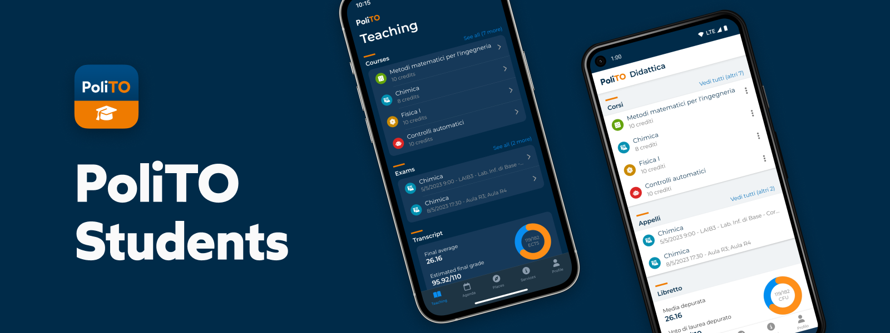

# PoliTO Students App

Politecnico di Torino's official mobile application for students.

## Install

### From app stores

[Google Play Store](https://play.google.com/store/apps/details?id=it.polito.students)  
[Apple App Store](https://apps.apple.com/us/app/polito-students/id6443913305)

### Start from source

To start the app locally you'll need git and a recent version of Node.js (see [Contributing](../CONTRIBUTING.md#project-setup)) for more details.
